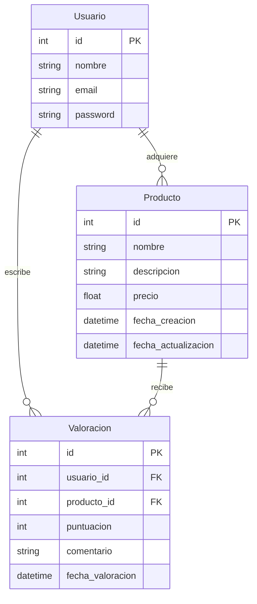

# API de Gestión de Productos "Valority"
## Descripción
Desarrollamos una **API** de Gestión de Productos que permite a los usuarios realizar **operaciones CRUD** en una base de datos con las tablas de Usuarios, Productos y Valoraciones. Los usuarios podrán registrarse, iniciar sesión, cerrar sesión y gestionar productos. La **autenticación** se implementará con *Sanctum*, usando tokens de acceso que expiran y se regeneran periódicamente. Además, la API incluirá una sección de valoraciones y comentarios para que los usuarios dejen sus opiniones sobre los productos.

Una característica clave será calcular el promedio de las valoraciones por producto y destacar el mejor valorado, ayudando a los usuarios a tomar decisiones informadas. La API ofrecerá una experiencia interactiva y segura, facilitando tanto la **gestión de productos** como la retroalimentación de los usuarios, creando una plataforma robusta y eficiente para la gestión y **valoración de productos**.

## Modelo Entidad - Relación
El *modelo entidad-relación (MER)* del proyecto se compone de las siguientes tablas y relaciones:

## Documentación de la API con Postman
La documentación de la API se encuentra en el siguiente enlace de Postman:
[Ejecutar en Postman](https://documenter.getpostman.com/view/21524567/2sA3kSm2tu)

## Tecnologías
- Laravel
  - Sanctum
  - Eloquent
- PHP
- MySQL
- Composer
- Postman
- Git